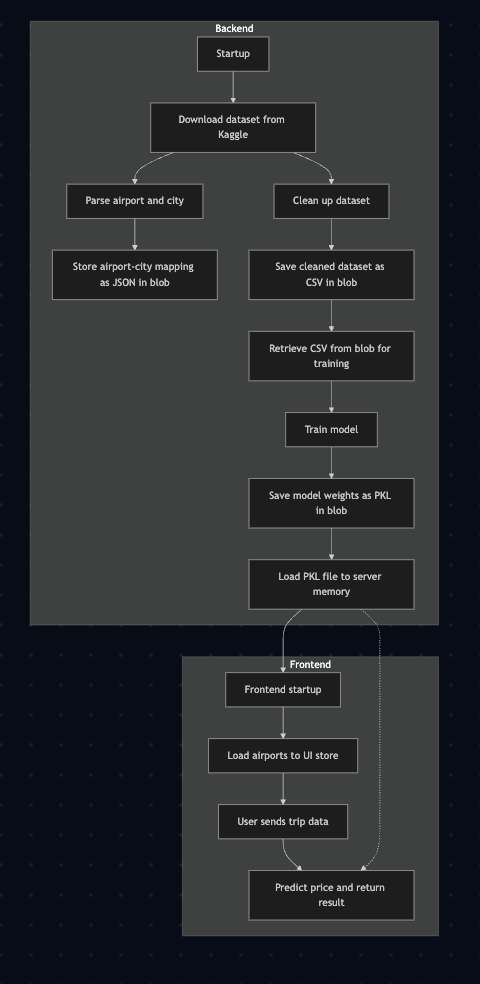

# Airplane Tickets Prediction

Predict future airplane ticket prices using machine learning. This project helps users estimate ticket costs based on historical data and relevant features.

## Features

- Automated data preprocessing and feature engineering
- Robust model training and evaluation pipeline
- Real-time price prediction for user queries

## Getting Started

### Prerequisites

1. **Docker**: Ensure Docker is installed. [Installation Guide](https://www.docker.com/get-started/)
2. **Kaggle API Key**: Download your Kaggle API key. [Instructions](https://www.kaggle.com/docs/api#:~:text=In%20order%20to%20use%20the%20Kaggle%E2%80%99s%20public%20API%2C%20you%20must%20first%20authenticate%20using%20an%20API%20token.%20Go%20to%20the%20%27Account%27%20tab%20of%20your%20user%20profile%20and%20select%20%27Create%20New%20Token%27.%20This%20will%20trigger%20the%20download%20of%20kaggle.json%2C%20a%20file%20containing%20your%20API%20credentials.)
3. **Environment Variables**: Copy `.env.example` to `.env` in the `backend` directory and add your Kaggle credentials.

### Installation

```bash
git clone git@github.com:StaVergos/airplane-tickets-prediction.git
cd airplane-tickets-prediction
```

### Usage

1. **Build Docker images:**
    ```bash
    docker compose build --no-cache
    ```
2. **Start the services:**
    ```bash
    docker compose up -d
    ```

## Project Structure

### Backend

- `src/config/` — Configuration, constants, and secrets
- `src/model_trainer/` — Data preprocessing, model training, and prediction logic
- `src/data_loader/` — Dataset download, transformation, and storage
- `src/minio/` — Blob storage integration
- `main/` — FastAPI application and API endpoints

### Frontend

- `src/App.tsx` — Main React application
- `src/components/AirportDropdown.tsx` — Airport selection dropdown component

## Workflow



## License

This project is licensed under the MIT License.